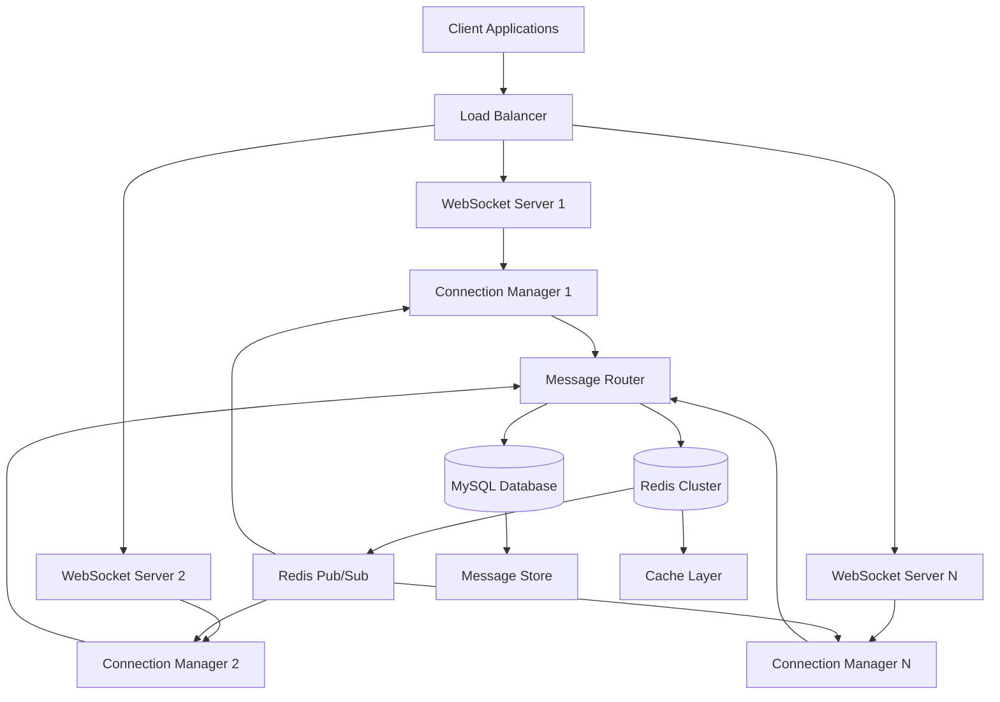

# Design Document: IM Backend Service

## Overview

The IM Backend Service is a high-performance, scalable instant messaging system built on Egg.js that supports real-time communication, custom message types, and enterprise-grade reliability. The system leverages WebSocket connections for real-time messaging, MySQL for persistent storage, and Redis for caching and message routing across multiple server instances.

The architecture follows a microservices-inspired approach with clear separation of concerns: connection management, message routing, data persistence, and caching layers work together to provide sub-100ms message delivery while supporting 10,000+ concurrent connections.

## Architecture

### System Architecture Diagram



### Core Components

1. **WebSocket Server Layer**: Egg.js applications handling WebSocket connections
2. **Connection Manager**: Manages user sessions and WebSocket connections
3. **Message Router**: Routes messages between users and handles delivery logic
4. **Message Store**: MySQL-based persistent storage for messages
5. **Cache Layer**: Redis-based caching for performance optimization
6. **Pub/Sub System**: Redis pub/sub for inter-server communication

## Components and Interfaces

### Connection Manager

**Responsibilities:**
- Maintain WebSocket connections and user sessions
- Handle user authentication and authorization
- Manage connection lifecycle (connect, disconnect, reconnect)
- Track online/offline status

**Key Methods:**
```typescript
interface ConnectionManager {
  authenticateUser(token: string): Promise<User>
  registerConnection(userId: string, socket: WebSocket): void
  removeConnection(userId: string, socketId: string): void
  getUserConnections(userId: string): WebSocket[]
  broadcastToUser(userId: string, message: Message): Promise<void>
}
```

### Message Router

**Responsibilities:**
- Route messages between users
- Handle message delivery and acknowledgments
- Implement delivery guarantees and retry logic
- Coordinate with cache and database layers

**Key Methods:**
```typescript
interface MessageRouter {
  routeMessage(message: Message): Promise<DeliveryResult>
  handleOfflineMessage(message: Message): Promise<void>
  getMessageHistory(userId: string, conversationId: string, limit: number): Promise<Message[]>
  markMessageDelivered(messageId: string): Promise<void>
}
```

### Message Store

**Responsibilities:**
- Persist messages to MySQL database
- Provide message history and search capabilities
- Handle database connection pooling
- Implement data retention policies

**Database Schema:**
```sql
CREATE TABLE messages (
  id BIGINT PRIMARY KEY AUTO_INCREMENT,
  message_id VARCHAR(36) UNIQUE NOT NULL,
  sender_id BIGINT NOT NULL,
  recipient_id BIGINT NULL,
  conversation_id VARCHAR(36) NOT NULL,
  message_type VARCHAR(50) NOT NULL DEFAULT 'text',
  content JSON NOT NULL,
  metadata JSON NULL,
  created_at TIMESTAMP DEFAULT CURRENT_TIMESTAMP,
  delivered_at TIMESTAMP NULL,
  INDEX idx_conversation_created (conversation_id, created_at),
  INDEX idx_recipient_created (recipient_id, created_at)
);

CREATE TABLE conversations (
  id VARCHAR(36) PRIMARY KEY,
  type ENUM('direct', 'group') NOT NULL,
  participants JSON NOT NULL,
  created_at TIMESTAMP DEFAULT CURRENT_TIMESTAMP,
  updated_at TIMESTAMP DEFAULT CURRENT_TIMESTAMP ON UPDATE CURRENT_TIMESTAMP
);

CREATE TABLE users (
  id BIGINT PRIMARY KEY AUTO_INCREMENT,
  username VARCHAR(100) UNIQUE NOT NULL,
  email VARCHAR(255) UNIQUE NOT NULL,
  password_hash VARCHAR(255) NOT NULL,
  last_seen TIMESTAMP NULL,
  created_at TIMESTAMP DEFAULT CURRENT_TIMESTAMP
);
```

### Cache Layer

**Responsibilities:**
- Cache frequently accessed messages and user data
- Implement cache invalidation strategies
- Provide fast lookup for online users
- Store temporary message queues for offline users

**Redis Data Structures:**
```typescript
interface CacheStructures {
  // Online users set
  'online_users': Set<string>
  
  // User connection mapping
  'user_connections:{userId}': Set<string>
  
  // Message cache
  'messages:{conversationId}': List<Message>
  
  // Offline message queue
  'offline_queue:{userId}': List<Message>
  
  // Delivery acknowledgments
  'ack_pending:{messageId}': string
}
```

## Data Models

### Message Model

```typescript
interface Message {
  id: string
  messageId: string
  senderId: string
  recipientId?: string
  conversationId: string
  messageType: string
  content: MessageContent
  metadata?: MessageMetadata
  timestamp: Date
  deliveryStatus: 'pending' | 'delivered' | 'failed'
}

interface MessageContent {
  text?: string
  attachments?: Attachment[]
  customData?: Record<string, any>
}

interface MessageMetadata {
  priority?: 'low' | 'normal' | 'high'
  ttl?: number
  encryption?: EncryptionInfo
  customFields?: Record<string, any>
}
```

### User Session Model

```typescript
interface UserSession {
  userId: string
  sessionId: string
  socketId: string
  connectedAt: Date
  lastActivity: Date
  deviceInfo: DeviceInfo
  isOnline: boolean
}

interface DeviceInfo {
  platform: string
  version: string
  userAgent?: string
}
```

### Conversation Model

```typescript
interface Conversation {
  id: string
  type: 'direct' | 'group'
  participants: string[]
  createdAt: Date
  updatedAt: Date
  metadata?: ConversationMetadata
}

interface ConversationMetadata {
  name?: string
  description?: string
  settings?: ConversationSettings
}
```

Now I need to use the prework tool to analyze the acceptance criteria before writing the correctness properties:

<function_calls>
<invoke name="prework">
<parameter name="featureName">im-backend-service

## Correctness Properties

*A property is a characteristic or behavior that should hold true across all valid executions of a system—essentially, a formal statement about what the system should do. Properties serve as the bridge between human-readable specifications and machine-verifiable correctness guarantees.*

### Property 1: Authentication and Session Management
*For any* valid user credentials, authentication should succeed and create a valid session that can be used for WebSocket connections, and when sessions expire or users disconnect, cleanup should occur properly.
**Validates: Requirements 1.1, 1.2, 1.3, 1.4**

### Property 2: Concurrent Session Support
*For any* user, the system should support multiple concurrent sessions across different devices without interference.
**Validates: Requirements 1.5**

### Property 3: Message Delivery Guarantees
*For any* message sent to an online recipient, the message should be delivered immediately with delivery confirmation sent back to the sender, implementing at-least-once delivery semantics.
**Validates: Requirements 2.1, 2.6, 7.1, 7.3**

### Property 4: Offline Message Handling
*For any* message sent to an offline recipient, the message should be persisted and delivered when the recipient comes online.
**Validates: Requirements 2.2, 2.3**

### Property 5: Direct and Group Messaging
*For any* valid user pair or group, the system should support message exchange between participants.
**Validates: Requirements 2.4, 2.5**

### Property 6: Custom Message Round Trip
*For any* valid custom message with structured data and metadata, storing then retrieving the message should preserve all custom fields and data without modification.
**Validates: Requirements 3.1, 3.2, 3.3, 3.5**

### Property 7: Message Schema Extensibility
*For any* defined message schema for different content types, the system should accept and process messages conforming to that schema.
**Validates: Requirements 3.4**

### Property 8: Message Persistence Round Trip
*For any* message, storing it to the database then retrieving it should return an equivalent message with all data preserved.
**Validates: Requirements 5.1**

### Property 9: Cache Behavior and Consistency
*For any* frequently accessed message, the cache should store it for faster retrieval, and cache invalidation should maintain consistency when data changes.
**Validates: Requirements 5.2, 5.4**

### Property 10: Cache-First Retrieval
*For any* message history request, the system should check cache first before querying the database.
**Validates: Requirements 5.3**

### Property 11: Error Handling and Recovery
*For any* database connection failure or critical error, the system should handle errors gracefully, attempt recovery with exponential backoff, and log detailed error information.
**Validates: Requirements 5.5, 6.1, 6.4**

### Property 12: Graceful Degradation
*For any* Redis unavailability scenario, the system should continue operating with degraded performance rather than failing completely.
**Validates: Requirements 6.2**

### Property 13: Health Check Availability
*For any* system state, health check endpoints should return appropriate status information for monitoring.
**Validates: Requirements 6.3**

### Property 14: Graceful Shutdown
*For any* running system state, initiating shutdown should result in graceful cleanup and resource release.
**Validates: Requirements 6.5**

### Property 15: Message Retry and Failure Handling
*For any* failed message delivery, the system should retry with backoff, and after maximum attempts, mark the message as failed.
**Validates: Requirements 7.2, 7.4**

### Property 16: Delivery Status API
*For any* message, the system should provide APIs to query its delivery status and return accurate information.
**Validates: Requirements 7.5**

## Error Handling

### Connection Errors
- **WebSocket Connection Failures**: Implement automatic reconnection with exponential backoff
- **Database Connection Failures**: Use connection pooling with health checks and failover
- **Redis Connection Failures**: Graceful degradation to database-only mode

### Message Delivery Errors
- **Recipient Offline**: Queue messages for later delivery
- **Network Failures**: Implement retry logic with exponential backoff
- **Message Validation Failures**: Return descriptive error responses

### System Errors
- **Memory Pressure**: Implement circuit breakers and load shedding
- **High CPU Usage**: Use message queuing and rate limiting
- **Disk Space Issues**: Implement log rotation and cleanup procedures

## Testing Strategy

### Dual Testing Approach

The system will use both unit tests and property-based tests for comprehensive coverage:

**Unit Tests** will verify:
- Specific examples of message routing and delivery
- Edge cases like empty messages, invalid tokens, and malformed data
- Integration points between components
- Error conditions and exception handling

**Property-Based Tests** will verify:
- Universal properties across all valid inputs using fast-check library
- Message delivery guarantees across randomized scenarios
- Data persistence and retrieval consistency
- Authentication and session management across various user states

### Property-Based Testing Configuration

- **Testing Library**: fast-check for Node.js/TypeScript
- **Test Iterations**: Minimum 100 iterations per property test
- **Test Tagging**: Each property test tagged with format: **Feature: im-backend-service, Property {number}: {property_text}**

### Testing Focus Areas

**Core Logic Testing**:
- Message routing algorithms with randomized user and message data
- Authentication flows with various credential combinations
- Session management across different connection scenarios

**Integration Testing**:
- WebSocket connection handling under various network conditions
- Database and cache interaction patterns
- Inter-service communication via Redis pub/sub

**Performance Testing**:
- Connection scaling tests up to 10,000 concurrent connections
- Message throughput testing under high load
- Memory and CPU usage profiling during peak operations

The testing strategy ensures both functional correctness through property-based testing and practical reliability through targeted unit tests, providing confidence in the system's behavior across all operational scenarios.